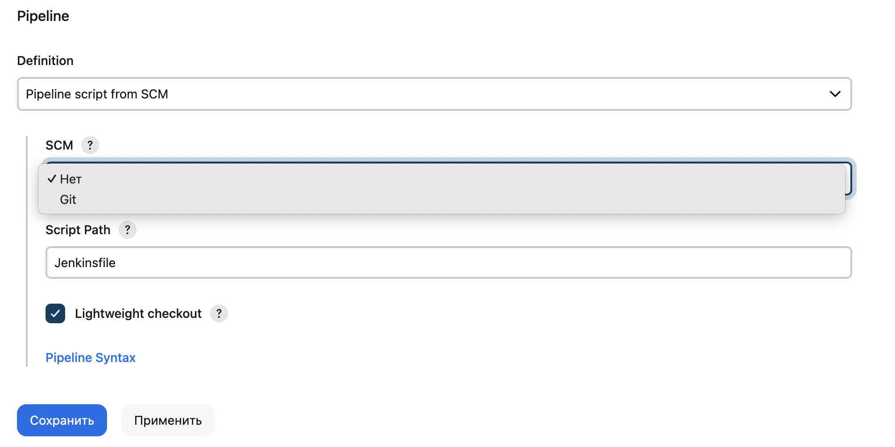
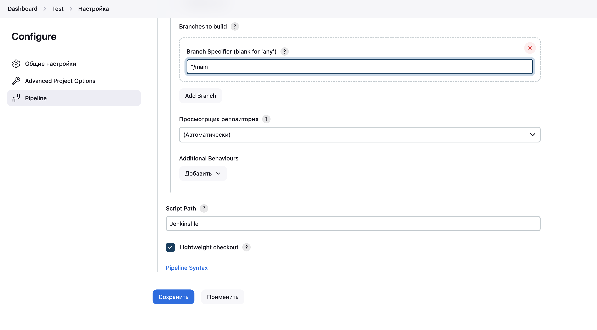

# DevOps 

## Задача 1

**Условие.** Описать процесс сборки и доставки кода на конечную платформу до работающего приложения на сервере:
- gitflow;
- userflow;
- CI (stages);
- CD (deploy, update, rollback).

### Решение

Прежде чем приступать к описанию процесса сборки и доставки кода на конечную платформу, рассмотрим GitFlow, userflow, CI и CD по отдельности.

**1. GitFlow**
GitFlow - это некоторая методология работы с Git. Она создана для изоляции процессов разработки, тестирования, деплоя и релиза посредством специальной модели ветвления. Автор *Vincent Driessen* опубликовал описание методологии GitFlow в 2010: <link>https://nvie.com/posts/a-successful-git-branching-model/</link>

Думаю, не стоит переписывать перевод содержания статьи, для поставленной задачи достаточно описать в двух словах механизм ветвления и назначение каждой ветки.

Итак, на начальном этапе рассмотрим две ветки:
- main;
- develop.

Первая ветка **main** содержит в себе стабильно работающую версию кода разрабатываемого приложения, код из этой ветки разворачивается в проде, доступ к этой ветке ограничен. Вторая ветка **develop** используется разработчиками и тестировщиками, в ней всегда содержится актуальная версия кода. Под каждую фичу создаётся новая ветка, по окончании работы над фичей ветка мёрджится в **develop**. Тестирование кода можно проводить как в ветке фичи, так и в отдельной одноимённой ветке под тесты, которая ответвляется от **develop**. Все фиксы найденных багов пушатся в **develop**. 

После проверки функционала в **develop** ветке тестировщиками ответвлением от последней создаётся ветка **release**. В ней возможны фиксы багов (изменения после согласуются с **develop**), обновление конфигураций под новую версию релиза, очередные проверки работоспобоности кода, внедрять новые фичи запрещено. Как только релиз готов, он мёрджится в ветку **main**. 

Если в **main** найден баг, создаётся ветка **hotfix**, где вносятся все необходимые изменения в код, вновь проводятся тесты. Когда всё прошло успешно, ветка вновь мёрджится в **main** и **develop**. 

Пример работы GitFlow представлен в виде изображения ниже.
<embed src="https://nvie.com/files/Git-branching-model.pdf" width="600" height="500" type="application/pdf">

В сравнительно небольшом проекте можно обойтись GitFlow без дополнительной автоматизации, тогда тесты, сборка и вывод в прод проводятся вручную. Мёрджи в ветки **develop** и **main** проводятся по pull-requestам. Процесс сборки и доставки кода на конечную платформу до работающего приложения может выглядеть следующим образом (один из сценариев):
1. разработчик ответвляется от **develop** в некоторую ветку **feature**;
2. как только фича готова, разработчик запускает автотесты (положим, что тестировщиков нет, разработчик сам пишет тесты, хоть и это не самая лучшая практика);
3. положим, что тесты прошли успешно, разработчик создаёт pull-request в **develop**;
4. тимлид проводит code-review, положим, что с кодом всё хорошо, тимлид одобряет pull-request;
5. новая фича была последней в спринте, разработка новой версии завершена, за работу приступает релиз-инженер, который создаёт ветку **release**;
6. релиз-инженер ещё раз всё проверяет, меняет конфигурации, возможно деплоит приложение для ручного тестирования, обновляет названия пакетов под новую версию, создаёт тэги и т. п.;
7. если всё ок, релиз-инженер мёрджит ветку **release** в ветку **main**, изменения которой применяются в проде (сервер под прод отдельный, подробности обновления опустим).

**2. Userflow**
Вообще говоря, с userflow ранее не был знаком. В открытых источниках userflow упоминается как некоторая последовательность действий, которую должен проделать пользователь при взаимодействии с некоторым ПО для достижения какой-то цели. Чаще всего последовательность представляется в виде диаграммы. Цель последней предоставить возможность команде разрабатываемого продукта взглянуть на взаимодействие пользователя и приложения глазами пользователя.

Сразу встаёт вопрос о том, кого считать пользователем. Можно рассмотреть два варианта, когда речь идёт:
1. о приложении (продукте), который разрабатывает команда, и пользователе, который будет взаимодействовать с приложением;
2. о инфраструктуре разработки, с которой будут взаимодействовать разработчики, тестировщики, релиз-инженеры и т. д.

Первый вариант актуален для UX/UI-разработчиков, вероятно, автор задания подразумевал не этот случай userflow. Второй же вариант ближе к DevOps, поэтому остановимся на нём.

Ответим на три вопроса:
1. Кто является пользователем?
2. Какова его цель?
3. Какие шаги он должен предпринять для достижения этой цели?

*Источник:* <link>https://habr.com/ru/articles/496760/</link>

Пусть пользователем будет разработчик некоторого приложения. Рассмотрим сценарий, в котором его целью будет пуш фичи, которую он разработал, при этом фича должна собраться и пройти ряд тестов и проверок. Какие же шаги он должен предпринять? 


**3. CI**
Дословно CI - continious integration, под чем понимают автоматическую сборку кода, тестирование (здесь же линтеры, SAST) и деплой (а здесь может быть DAST). Цель CI упростить жизнь команде при разработке приложения за счёт той самой автоматизации. Что такое **stages** и **jobs**? Под **stage** понимается группа задач, которыми определяется один из этапов (build, test, deploy). Под **job** понимают задачу, например запуск теста, сборка контейнера или проверка кода линтером. Из **stages** выстраивается конвейер (**pipline**).


**3. CD**
Дословно CD - continious delivery, под чем понимают автоматическое развёртывание приложения в прод. CD включает в себя:
1. deploy - развёртывание приложения в прод;
2. update - внесение изменения в развёрнутое приложение (фикс багов, обновление версии);
3. rollback - возврат к предыдущей версии (восстанавливаются старые конфигурации и артефакты приложения).

Понятно, что CD есть нечто больше, чем перечисленные три действия, CD запускается релиз-инженером при тщательной проверке и по окончании всех подготовительных мероприятий. Возможна балансировка потока клиентов приложения - новые клиенты сразу получают доступ к приложению (речь про web) пока сессии старых клиентов сохраняются, то есть update проводится на серверах постепенно. 

Настало время сложить пазл воедино. Попытаемся очень абстрактно описать процесс сборки и доставки кода на конечную платформу до работающего приложения на сервере с использованием всего вышеперечисленного. 

##### Шаг 1
Разработчик делает последний коммит изменений кода своей фичи.

##### Шаг 2
Разработчик пушит изменения в репу.

##### Шаг 3
Запускается CI pipeline.

##### Шаг 4
Build:
    make_env (подготавливается окружение)
    build (собирается приложение, например в контейнер)

##### Шаг 5
Test:
    linting (проверка кода на соответствие стандартам)
    unit_testing
    integration_testing
    …
    SAST

##### Шаг 6
Deploy:
    run (например, запуск контейнера)
    DAST

##### Шаг 7
Всё прошло успешно, разработчик отправляет pull-request в ветку **develop**, это была последняя фича. 

##### Шаг 8
Тимлид подтверждает pull-request в **develop**.

##### Шаг 9
Запускается CI (шаги 4-6).

##### Шаг 10
Всё прошло успешно, релиз-инженер тегает собранный артефакт.

##### Шаг 11
Релиз-инженер мёрджит **develop** в **main**.

##### Шаг 12
Запускается CD update (скорее всего по подтверждению релиз-инженера) - релиз новой версии приложения.

Под CI pipeline выделены агенты (runners). CD же производит изменения на серверах прода. Userflow должен выглядеть следующим образом.


## Задача 2

**Условие.** 
- Поднять сервер Jenkins (не важно как, docker или хост).
- Настроить на Jenkins сборку компонента Hadoop из ветки 3.3.*.
- Поднять из получившегося дистрибутива однонодовый Hadoop кластер.
- Записать скринкаст с демонстрацией пайплайна  и работающего кластера, в hdfs которого можно сложить файлик.

Код пайплайна, исходники Hadoop, тесткейсы и описание как запускать выложить на GitHub.

### Решение

Будем полагать, что у проверяющего уже установлен Jenkins.
Для запуска на **Mac OS** необходимо последовательно выполнить ряд следющих действий.
1. Открыть Dashboard в Jenkins, выбрать **Создать Item**.

2. Ввести имя **Hadoop** (это важно для согласования имён контейнеров, переменные окружения не подключал), выбрать **Pipeline**, нажать **OK**.

3. В разделе **Pipeline** выбрать **Pipeline script from SCM** в графе **Definition.

4. В графе SCM выбрать Git.

5. В графу **Repository URL** вставить ссылку на этот репозиторий <link>https://github.com/spacewall/devops.git</link>

6. В графе **Branches to build** поменять название ветки на **main**.

7. Нажать сохранить.

8. Запустить pipeline по кнопке **Собрать сейчас**.


Кроме того, необходимо поменять файл /opt/homebrew/Cellar/jenkins-lts/2.462.2/homebrew.mxcl.jenkins-lts.plist, добавив туда следующий код:
```
<key>EnvironmentVariables</key>
	<dict>
	<key>PATH</key>
	<string>/usr/local/bin:/usr/bin:/bin:/usr/sbin:/sbin:/Applications/Docker.app/Contents/Resources/bin/:/Users/???/Library/Group\ Containers/group.com.docker/Applications/Docker.app/Contents/Resources/bin</string>
	</dict>
```
где ```???``` имя пользователя Mac OS. Это необходимо для экспорта **PATH** в Jenkins (он развёрнут локально). *Подробнее:* <link>https://www.jenkins.io/doc/book/pipeline/docker/</link>